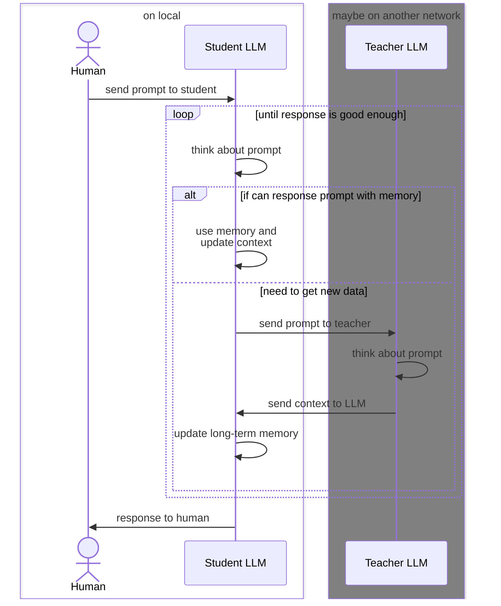

# Project: Distributed Hierarchical LLM Systems with Externalized Memory, Cognitive Compilation, and Policy Caching

This repository provides a concrete implementation of a **Hierarchical Distributed Cognitive Architecture (HDCA)** that externalizes memory, planning, and policy structure from large language models into deterministic artifacts. Rather than treating a monolithic LLM with an ever-growing context window as the substrate of intelligence, this project operationalizes a **distributed cognitive system** in which:

* **LLMs** act as stochastic policy evaluators and decision oracles over structured symbolic state spaces.
* **Python classes, methods, and deterministic execution environments** implement the stable substrate of cognition.
* **Logs, synthesized code, and caches** serve as persistent externalized memory, enabling amortized inference and cognitive compilation across time.

The core research hypothesis is that **intelligence can be progressively compiled out of neural inference and into deterministic symbolic artifacts**, enabling smaller models with bounded context to approximate or surpass the performance of much larger models on structured tasks.

This repository instantiates the architectural abstractions described in `phd.md` and provides explicit insertion points for external memory consolidation, cache-based amortized inference, and program synthesis–driven tool discovery.

---

## 1. Mapping the HDCA Framework to This Repository

### 1.1 Conceptual Architecture (HDCA)

The HDCA framework proposes a hierarchical cognitive system consisting of four interacting tiers:

1. **Teacher LLM (Cloud-scale, Large Model)**
   Responsible for ontology discovery, macro-action synthesis, exploratory reasoning, and program induction.

2. **Student LLM (Local, Small Model)**
   Executes runtime decision policies over a bounded symbolic state space using a fixed tool ontology.

3. **External Memory Substrate**
   A persistent memory layer consisting of logs, structured caches, and compiled symbolic artifacts (code, schemas, macro-actions).

4. **Deterministic Execution Substrate**
   The environment of synthesized functions, object-oriented interfaces, and symbolic state transitions that ground cognition in executable semantics.

The fundamental theoretical move is to **externalize cognition from the neural substrate into symbolic and deterministic artifacts**, enabling long-horizon reasoning with bounded context windows.

---

### 1.2 Implementation-Level Mapping

This repository realizes the HDCA tiers as follows:

#### Student Policy LLM

* Implemented via `response_llm` in `models/llm.py`, currently using an Ollama-served local model (default: `gemma3:4b`).
* All cognition is mediated through structured prompt templates in `prompts/`, enforcing a symbolic interface between the LLM and the environment.
* The LLM acts strictly as a **policy oracle** over a symbolic object-oriented action space.

#### Object-Oriented Action Space and Environment

* The core runtime entity is `MopAgent` (`mop.py`), which:

  * Treats public methods as actions and attributes as symbolic state.
  * Serializes its state and action ontology into textual schemas consumed by the LLM.
  * Executes chosen actions deterministically in Python.

This realizes an **object-oriented cognitive substrate**, where classes define ontologies and methods define affordances.

#### Meta-Level Ontology Expansion (Teacher Proxy)

* `GodAgent` in `mop.py` functions as a meta-agent capable of synthesizing new agent classes via LLM-guided program synthesis.
* This mechanism approximates the Teacher LLM tier by expanding the symbolic ontology rather than acting within a fixed ontology.

#### Externalized Memory via Logs and Artifacts

* Every LLM call is logged in `logs/` with:

  * Full serialized state.
  * Prompt templates and rendered prompts.
  * Model outputs.
* These logs constitute a primitive episodic memory substrate suitable for trajectory reconstruction, offline analysis, and future memory consolidation pipelines.

#### Program Synthesis Hooks

* `_add_action` in `mop.py` uses `prompts/add-action.md` to synthesize new deterministic methods, materialized in `agents/{ENTITY_NAME}.py`.
* This implements **library learning and program induction**, allowing the agent’s ontology to expand over time.

---

## 2. Formalizing MopAgent as a Policy Over an Object-Oriented Action Space

### 2.1 Symbolic State Representation

At discrete timestep t, the agent state is defined as:

s_t = (prompt_t, docstring, status_vector_t, A(s_t), codebase_state_t)

Where:

* **prompt_t**: bounded textual problem context.
* **docstring**: agent semantic specification.
* **status_vector_t**: serialized public attributes representing symbolic persistent state.
* **A(s_t)**: serialized action ontology derived from public methods.
* **codebase_state_t**: current synthesized and handwritten method definitions.

This representation replaces raw conversational history with a structured symbolic cognitive state.

---

### 2.2 Action Space Taxonomy

The agent selects actions from a heterogeneous action space:

1. **Tool Invocation**: a_t = (method_name, args) ∈ A(s_t)
2. **Direct User Response**: a_t = response_user
3. **Program Synthesis**: a_t = add_method(name, description, args)

The policy is implemented by the LLM using the `think.md` schema:

π_θ(a_t | s_t)

Where θ are the neural parameters of the underlying model.

---

### 2.3 Transition Dynamics

Transitions are deterministic conditioned on LLM-selected actions:

* **Tool Invocation** → deterministic Python execution + narrative integration via `action.md`.
* **Program Synthesis** → ontology expansion via code generation and insertion.
* **User Response** → episode termination.

This establishes a hybrid stochastic–deterministic Markov Decision Process with expanding action space.

---

## 3. Externalized Memory, Bounded Context, and Cognitive Compilation

A central HDCA claim is that **bounded-context LLMs can perform unbounded-horizon reasoning when cognition is externalized**.

In this implementation:

* The LLM receives only symbolic summaries and bounded prompt slices.
* Full trajectories are persisted externally.
* Synthesized code and caches represent compiled cognitive routines.

This separation enables a **cognitive compilation pipeline**:

Teacher Reasoning → Logs → Abstraction → Cache / Code → Student Execution

---

## 4. Caching as Amortized Inference and Cognitive Memoization

Caching is interpreted as amortized inference over π_θ and its subroutines.

### 4.1 Levels of Cognitive Caching

1. **Decision Cache** (Level 1)
   Maps φ(s) → a_t

2. **Explanation Cache** (Level 2)
   Maps (what, why, how) → narrative integration text

3. **Program Synthesis Cache** (Level 3)
   Maps (name, description, args) → deterministic program blueprint

Each cache tier corresponds to a different cognitive abstraction layer.

---

### 4.2 Canonical State Fingerprinting

A canonical fingerprint φ(s) must encode structural semantics rather than raw prompt text:

* Agent identity and ontology hash
* Canonicalized status vector serialization
* Canonicalized action ontology serialization
* Prompt abstraction (truncated text, embeddings, or symbolic task descriptors)
* Template and model version identifiers

This fingerprint defines cache key semantics and guards against ontology drift.

---

## 5. Object-Oriented Cognitive Design Patterns

### 5.1 LLM Client Abstraction

`response_llm` is the choke point for introducing:

* LLMClient with pluggable CacheStrategy
* Versioned prompt schemas
* Unified telemetry and provenance tracking

### 5.2 Hierarchical Cache Strategy

Future cache backends may include:

* In-memory LRU caches
* Persistent disk-backed stores (SQLite, LMDB)
* Remote distributed caches

### 5.3 Prompt and Ontology Versioning

Cache keys must incorporate:

* Model identity
* Prompt template hashes
* Code template versions

This enforces reproducibility and prevents stale cognitive artifacts.

---

## 6. Experimental Design and Evaluation Protocol

### 6.1 Metrics

* Token usage vs. task horizon
* Success rate vs. model size
* Latency and compute cost
* Cache hit rate and cognitive degradation metrics

### 6.2 Baselines

* ReAct-style agents without caching
* Long-context memory agents (MemGPT-like)
* Tool-augmented agents without program synthesis

---

## 7. Limitations, Failure Modes, and Safety

### 7.1 Missing Production Memory Layer

Current logs constitute episodic memory but lack consolidation, abstraction, and forgetting mechanisms.

### 7.2 Cache Staleness and Ontology Drift

Caches must detect:

* Environmental changes
* Prompt schema drift
* Model upgrades

### 7.3 Program Synthesis Risks

Synthesized code must be sandboxed, statically analyzed, and unit-tested before execution.

### 7.4 Teacher–Student Separation

A full HDCA realization requires strict separation between remote ontology discovery and local runtime policy execution.

---

## 8. Research Hypothesis and Philosophical Framing

This project advances the hypothesis that **intelligence can be progressively compiled from neural inference into deterministic symbolic artifacts**, analogous to partial evaluation and memoization in programming language theory.

LLMs serve as high-entropy exploratory compilers, while deterministic code and caches serve as low-entropy executable cognition.

---

## 9. Future Directions

* Cognitive consolidation pipelines (log → abstraction → macro-actions)
* Proof-carrying synthesized code
  n- Memory hierarchy (episodic, semantic, procedural)
* Formal complexity and sample-efficiency analysis of amortized cognition

---

This repository thus provides a concrete instantiation of distributed hierarchical cognition, grounding abstract HDCA theory in executable software artifacts and creating a platform for empirical study of cognitive compilation, amortized inference, and ontology expansion in LLM-based agents.
